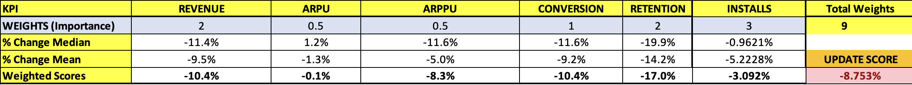
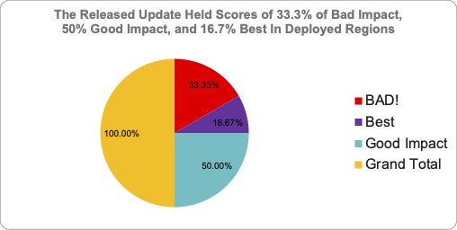

<!-- TOC -->
* [Update Score Method](#update-score-method)
<!-- TOC -->

# §1. Update Score Robustness:
In the event that Mean change is adversely affected by outliers, the median which is the failsafe measure of the mean corrects and eliminates the excessive noise in the Mean.

# §2. Update Score Customizable Weights:

The result is a single measure of maangement-perceived KPI Weights that is robust and captures all changes in the KPIs.
This approach provides a single, robustified measure of a pre-, and post-, event on weighted battery of KPIs. The KPI weights are customizable with management0-focused perspective: retention is 3X more vial than conversion; thus, Retention Weight is "3" and Conversion is "1".

# §3. Example using Dummy Data:

# §4. Visualized Result:

# §5. Excel Tool:

<a href="Update Score Method/Update Score Method.xlsx">Update Score Method.xlsx</a>

